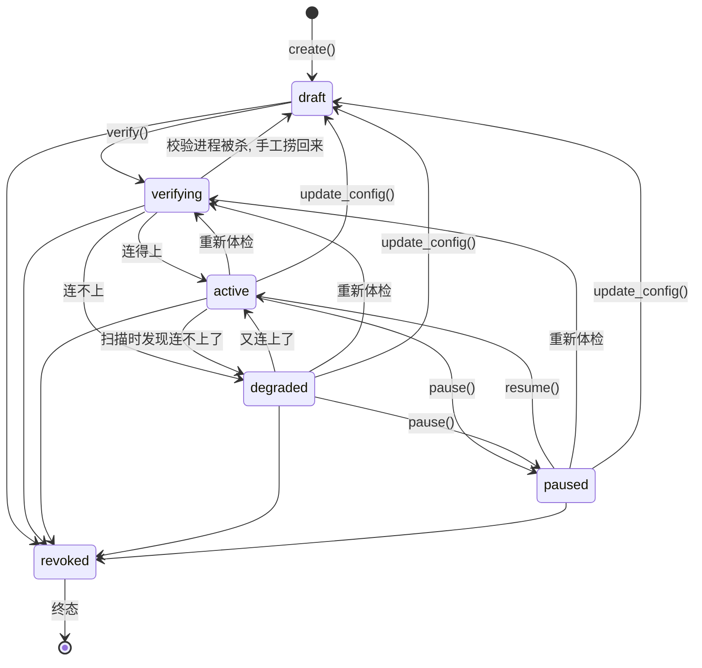

# Shovel 资源模块

> 对应代码: `exceptions/resource.py`、`domain/resource_state.py`、
> `services/connector_*.py`、`services/credentials.py`、
> `services/resource_service.py`、`cli/commands/resource.py`

资源 (Resource) 是 Shovel 里"一个外部数据源的实例"。它对标 Azure Data Factory
的 Linked Service: **不描述要搬什么, 只描述怎么连上**。要搬什么是 ScanProfile
的事, 什么时候搬是 Schedule 的事。

---

## 1. 一句话分工

```text
Resource 表        配置: 连哪个目录、用哪个凭据、权威度多少     可被 UPDATE
Connector          代码: 怎么连、怎么列举、怎么读               只能改代码
CredentialStore    秘密存在哪                                   不进数据库
state_machine      哪些状态能转到哪些                           不做任何 IO
ResourceService    把上面四个缝起来                             唯一的缝合点
```

这条边界解释了本模块几乎所有的设计选择。最重要的一条推论是:

**`Resource.connector_kind` 刻意不是外键。**

如果它是外键, "系统支持哪些数据源"就能被一条 `INSERT` 改掉, 而代码没变 ——
于是出现"表里写着支持 notion, 进程里根本没有 notion 实现"这种无法自愈的状态。
注册表则相反: 它的内容由"哪些模块被 import 了"唯一决定。一个查不到的 kind,
答案永远只有一个 —— 这个版本的 Shovel 不认识它。

规则是一句话: **配置进表, 能力进注册表。**

---

## 2. 状态机



### 几条不明显的规则, 以及为什么

**创建出来是 `draft` 而不是 `active`。**
创建只证明"配置的形状对了", 不证明"这个目录真的存在且可读"。只有 `verify()`
能证明后者。一个从未被校验过却显示 active 的资源, 会让调度器把它排进扫描队列,
然后在真正跑的时候才发现连不上 —— 而那时报错的上下文已经离配置很远了。

**`draft` 不能直接跳到 `active`。** 同上, 从签名上堵死。

**`paused` 不能直接进 `degraded`。**
暂停期间根本没在跑, 无从得知它是否降级。想知道就得先 `verifying`。

**`active` 与 `degraded` 可以互转。**
这是扫描过程中最频繁的一对转移(连上了 / 连不上了), 强制绕道 `verifying`
只会给每次扫描凭空加一次写库。

**任何非终态都能进 `revoked`。**
用户随时有权吊销一个资源, 不该被"必须先暂停"之类的流程挡住。

**`revoked` 是单向门。**
想再用, 建一个新资源。"撤销后不能复活"这条规则如果散落在 service 的五个方法里,
总有一处会漏掉, 而漏掉的后果是一个已被吊销的凭据又开始扫描。

### `assert_transition` 与 `plan_transition`

两个函数的差别只在**自转移**:

| | `old == new` | 用在哪 |
|---|---|---|
| `assert_transition` | 抛异常 | pause / resume / revoke —— 调用方明确要求状态必须变 |
| `plan_transition` | 返回 noop | verify —— 结果可能与现状相同 |

`assert_transition` 拒绝自转移是刻意的。允许它看上去无害, 实际上会掩盖
"我以为我改了状态, 其实没改"这类 bug —— 幂等应该由调用方显式判断
(见 `_enter_verifying` 里那句 `if row.state is VERIFYING: return`),
而不是由状态机默默吞掉。

`domain/resource_state.py` 在 import 时自检: 每个 `ResourceState` 都必须在
转移表里有一行, 且不能指向自己。新增一个状态却忘了写规则, 会在 import 时炸,
而不是等到某个用户恰好走到那条路径才抛 `KeyError`。

---

## 3. 连接器协议

### 为什么是 Protocol 而不是 ABC

连接器未来会来自插件(第三方包、甚至用户自己写的一个文件)。强制继承基类
意味着插件作者必须 import shovel 的内部模块才能被识别; Protocol 则只要
长得对就行。代价是拿不到默认实现 —— 但连接器本来就几乎没有可复用的默认行为。

**不要显式继承 `Connector`。** 继承一个 Protocol 会把里面的 `...` 当成默认实现
继承下去: 某个连接器忘了写 `verify`, 得到的不是报错, 而是一个永远返回 `None`
的 verify。只实现、不继承, 漏掉的方法才会在调用时立刻暴露。

同理没有加 `@runtime_checkable` —— 带数据成员 (`spec`) 的 Protocol 做
`isinstance()` 会直接抛 `TypeError`。

### 连接器不碰数据库

Connector 收到的是**已经解出来的** config 与 credential, 返回的是纯数据结构。
它不认识 `Session`, 不认识 `Resource` ORM 对象。直接好处是测试: 测一个连接器
只需要一个临时目录, 不需要建库建表塞一行资源。

### 能力 (Capability) 不是装饰性元数据

```python
DISCOVER        # 能列举。最低要求, 任何连接器都必须有
INCREMENTAL     # 能只列举"变过的"。没有它就只能 FULL_SWEEP
WATCH           # 能被动收变更通知, 而不是轮询
RANDOM_READ     # 能按条目单独取内容
DELETE_DETECT   # 全量结果可信为"完整列表", 因而能用差集推断删除
```

能力直接决定调度器允许配哪些 `ScanMode`。一个没有 `INCREMENTAL` 的连接器
配上增量调度, 只会得到一个每次都全量重扫、却自称"增量"的任务。与其让用户
在运行时才发现, 不如在创建 ScanProfile 时就拒绝。

`DELETE_DETECT` 尤其要谨慎声明: 一个不保证遍历期间一致性的分页 API 如果
声明了它, 一次漏页就会被当成"用户删了一批文档"。

### 写一个新连接器

```python
from typing import ClassVar
from pydantic import BaseModel, ConfigDict
from shovel.services.connector_base import (
    ConnectorCapability, ConnectorSpec, DiscoveredItem,
    DiscoveryScope, VerifyResult,
)
from shovel.services.connector_registry import register


class NotionConfig(BaseModel):
    model_config = ConfigDict(extra="forbid", frozen=True)
    workspace_id: str


@register                       # 注意: 不继承 Connector
class NotionConnector:
    spec: ClassVar[ConnectorSpec] = ConnectorSpec(
        kind="notion",
        display_name="Notion",
        description="...",
        config_model=NotionConfig,
        capabilities=frozenset({ConnectorCapability.DISCOVER}),
        requires_identity=True,
    )

    def __init__(self, config, credential=None): ...
    async def verify(self) -> VerifyResult: ...
    async def discover(self, scope: DiscoveryScope): ...   # async generator
    async def open(self, item: DiscoveredItem): ...        # async generator
```

然后在 `connector_registry.register_builtin_connectors()` 里加一行 import +
一次 `register(...)`。

> **为什么是显式 `register(...)` 而不是只靠 `@register`?**
> 装饰器只在模块**第一次** import 时执行。测试清空注册表之后再走这条路,
> 模块已经躺在 `sys.modules` 里, import 语句是个空操作, 装饰器不会再跑,
> 注册表会保持空的。显式调用是幂等的(同一个类重复注册不报错), 无论模块
> 是不是新导入的都能把表填回去。

`_ensure_builtins()` 里那句 `_BUILTINS_LOADED = True` 必须写在 import **之前**:
连接器模块顶层会回头调用 `register()`, 那次调用会重入注册表模块, 标志位没先
置位就是无限递归。

### `config_model` 是唯一的真相源

一处 pydantic 声明, 同时服务于三个场景: service 层的配置校验、CLI 的
`resource connectors --kind X` 字段提示、未来 Studio 的表单生成。
改成手写 dict schema, 这三处就会各自漂移。

所有 config 都应该是 `extra="forbid"` + `frozen=True`。前者让用户把
`root_path` 拼成 `rootpath` 时立刻收到报错, 而不是得到一个静默用默认值、
扫了个空目录还显示成功的资源。

### `VerifyResult.ok=False` 是返回值, 不是异常

校验失败是资源的一种**常态**(网线拔了、目录被删了、token 过期了),
而常态不该用异常表达 —— service 要做的是把它写进 `degraded`, 而不是
让整个 CLI 命令以栈回溯收场。真正的异常(代码 bug)仍然照常往上抛。

需要"校验不过就中止"的调用方传 `verify(ref, strict=True)`。

### `discover()` 不读内容

`DiscoveredItem` 里没有 content 字段。discover 的职责是"列出有什么",
取内容是 `open()` 的事。分开的理由是: "列举 20 万个文件"必须能在几秒内
完成并与已有的 Document 表做差集。如果 discover 顺带读盘, 一次增量扫描
就得把整个知识库读一遍, 增量也就没意义了。

`discover()` 返回 `AsyncIterator` 而不是 `list`, 同理 —— 几十万个条目
全装进内存, 在用户的笔记本上会直接把内存吃满。

---

## 4. `local_fs` 参考实现里的两个关键决定

### `external_id` 是相对 root 的 POSIX 路径

这是整个连接器最关键的一条约定。

用户把 `D:\notes` 改名成 `D:\my-notes` 之后, 如果 `external_id` 是绝对路径,
这个资源的**每一个**文档都会被认成"旧的全没了 + 新的全来了", 于是全量重新
embedding 一遍。用相对路径, 改名只影响 `Resource.config`, 文档一个都不用动。

统一用 POSIX 分隔符, 是为了让同一个知识库在 Windows 和 Linux 上算出来的 id
一致 —— 否则一次跨平台同步就等于一次全量重扫。

### `content_hash` 是 `st:{size}-{mtime_ns}` 而不是真哈希

真哈希要求把每个文件完整读一遍, 而 discover 的全部意义就在于"不读内容也能
知道有哪些东西、哪些变了"。在一个几十 GB 的目录上, 读盘算哈希会让一次增量
扫描退化成全量 IO。

代价是存在漏报(文件被改成同样大小、且 mtime 被刻意改回去)。这个场景在个人
知识库里可以忽略, 而真正需要强校验的场合(parse 阶段)可以在读内容时顺手
算真哈希。前缀 `st:` 标明"这是 stat 指纹, 不是内容哈希", 免得下游拿它
当 sha256 去比对。

### 其他

* `_ALWAYS_SKIP_DIRS`(`.git` / `node_modules` / `__pycache__` …)是**硬跳过**
  而不是"默认 exclude"。把 `.git` 索引进去除了烧掉几小时 embedding 额度之外
  没有任何收益。
* glob 用 `fnmatch`, 所以 `*` 会跨越 `/`。这和 shell 不同, 但是想要的:
  用户写 `*.md` 时期望的几乎一定是"所有层级的 md"。想限定层级的人会写
  `docs/*.md`。模式以 `/` 结尾时按目录前缀匹配。
* **include 为空 = 全要**, exclude 优先于 include。和 `.gitignore` 的直觉一致。
* `open()` 用 `external_id` 重新拼路径并做越界检查, 不信任 `item.uri`。
  数据库里的值未必全是本连接器自己写进去的, 一个构造出来的
  `../../../etc/passwd` 不该能读到 root 外面 —— 会抛 `ConnectorPathEscapeError`。

---

## 5. 凭据

### 数据库里只有引用, 没有秘密

`Resource.identity_ref` 存的是一个引用字符串:

```text
keyring:res_3f2a...      去操作系统凭据库里按这个 account 取
env:NOTION_TOKEN         去环境变量里取
```

数据库文件会被备份、会被同步、会被用户直接用 `sqlite3` 打开看。任何写进
`config_json` 的密钥, 都等于写进了这些地方。把秘密留在 keyring 或环境变量里,
泄露面就只剩"进程内存"这一处。

### keyring 不可用时**硬失败**

最容易写、也最糟糕的实现是"keyring 拿不到就退回明文文件"。用户会看到
"凭据已保存"、以为东西在系统凭据库里, 而实际上它躺在一个全局可读的文件里。

> 一个安全机制最坏的形态不是缺席, 而是看起来在、其实不在。

所以这里抛 `CredentialBackendUnavailableError`, 并在 hint 里告诉用户改用
`env:` 引用 —— 那是一个用户**知道**其安全边界的方案。

实现上要显式识别 `keyring.backends.fail.Keyring`: keyring 找不到任何后端时
不会报错, 而是装上这个"调用即抛异常"的假后端。不识别它, 用户收到的就是
一句看不懂的 `NoKeyringError`。

### 其他约定

* `env:` 引用是**只读**的 —— 进程改不了用户的 shell, 所以 `set` / `delete`
  直接抛错, 而不是假装成功。
* 环境变量名必须匹配 `^[A-Za-z_][A-Za-z0-9_]*$`。`env:FOO; rm -rf /` 这种东西
  应该在解析阶段就被拒绝。
* 空字符串按"没设置"处理。一个空 token 不可能是用户的本意, 而让它一路走到
  HTTP 401 才报错, 排查成本要高得多。
* `CredentialRef.for_resource()` 用 `resource_id` 而不是资源名做 account ——
  名字可以被改, 而改名不该让已经存好的密钥失联。
* CLI **不接受** `--secret xxx`。那个密钥会同时出现在 shell history、`ps`
  输出、部分系统的审计日志里 —— 三个用户完全意识不到的地方。只能
  `--secret-stdin` 或 `--ask-secret`(隐藏输入)。

---

## 6. 服务层的几处顺序敏感代码

### `create()`: flush → 写凭据 → commit

```python
session.add(resource)
await session.flush()          # 先拿到 id, 才能算出 keyring 的 account
self._credentials.set(ref, secret)   # 先写凭据
await session.commit()               # 再落库
```

反过来的话, 凭据写失败就会留下一行"指向一个不存在的密钥"的资源 ——
那种半成品状态没有任何自动修复的路径。

### `verify()` 中途多 commit 一次

进 `verifying` 时会先 commit 一次。这次多余的写入是有意的: 校验可能耗时数秒
(网络连接器更久), 期间另一个进程查到的状态应该是"正在校验", 而不是一个
过时的 `active`。

失败时**不刷新** `last_verified_at` —— 保留上一次成功的时间, UI 才能说出
"最后一次连通是三天前"。

### `update_config` 强制回落 draft, `update_metadata` 不动状态

`last_verified_at` 证明的是"旧配置在那个时刻是通的", 它对新配置不构成任何
证据。留在 `active` 等于用旧配置的体检报告给新配置背书。所以 `update_config`
会把状态打回 `draft` 并清空 `last_verified_at`。

而把描述从"我的笔记"改成"工作笔记", 没有任何理由让资源掉出 `active` ——
所以 description / sensitivity / authority 走另一个方法。

### `revoke` vs `delete`

| | 凭据 | 资源行 | 已索引的文档 |
|---|---|---|---|
| `revoke()` | 销毁 | 保留(terminal) | 保留 |
| `delete()` | 销毁 | 删除 | 由调用方清理 |

吊销的语义是"这个凭据不该再被 Shovel 持有了"。只改状态会让密钥继续躺在
系统凭据库里, 而用户以为自己已经收回了授权。但吊销的是**访问权**, 不是
已经索引过的知识。

`delete()` 返回被删资源的 id, 方便调用方把它送进 DeletionOutbox 去清向量。
`scan_profile` / `schedule` 靠外键 `ON DELETE CASCADE` 跟着走 —— 前提是
SQLite 的 `PRAGMA foreign_keys=ON` 真的生效(默认是 OFF, 忘了开的话级联会
静默失效, 只留下一堆孤儿行)。

这里用的是 Core 层的 `DELETE` 而不是 `session.delete(row)`: ORM 级联需要
先把 `profiles` 集合加载出来, 而在 async session 里那次隐式惰性加载会直接
抛 `MissingGreenlet`。这里要的本来就是数据库自己的级联。

### 创建资源时顺手建一个默认 ScanProfile

一个没有任何 profile 的资源永远不会被扫描, 而用户在 UI 上看到的是一个
"active 却什么都不做"的东西。默认给一个(名字固定为 `default`), 用户改它
比凭空发现自己少建了一个要容易得多。

扫描模式由 `spec.default_scan_mode()` 决定, 不写死 —— 能增量就增量,
因为全量扫描在用户的工作机上是最贵的动作。

---

## 7. CLI

```bash
shovel resource connectors                  # 这个版本支持哪些连接器
shovel resource connectors --kind local_fs  # 它接受哪些配置字段

shovel resource add notes --kind local_fs --set root_path=D:/notes
shovel resource add notes --kind local_fs --config-json '{"root_path": "D:/notes"}'
shovel resource add api --kind xxx --identity-ref env:MY_TOKEN
shovel resource add api --kind xxx --ask-secret        # 隐藏输入
cat token.txt | shovel resource add api --kind xxx --secret-stdin

shovel resource list [--state active] [--kind local_fs]
shovel resource show notes
shovel resource verify notes
shovel resource pause notes --reason "出差中"
shovel resource resume notes
shovel resource revoke notes      # 终态, 销毁凭据
shovel resource remove notes      # 删除, 级联 profile / schedule
```

`--set` 的值按 JSON 字面量解析, 解析失败则当字符串。于是
`--set follow_symlinks=true` 得到布尔值, 而 `--set root_path=D:/notes`
不会因为不是合法 JSON 就报错。

`show` **只显示凭据引用, 永远不显示值**。

---

## 8. 当前的文件布局(临时方案)

本轮实现时, 开发环境无法创建新目录, 所以资源模块的文件是**扁平**落在已有
包里的, 用 `resource_*` / `connector_*` 前缀区分。这是环境限制, 不是设计意图。

将来一次文件移动即可变成一个正经的 `shovel/resource/` 包:

| 现在 | 目标 |
|---|---|
| `exceptions/resource.py` | `resource/errors.py` |
| `domain/resource_state.py` | `resource/state_machine.py` |
| `services/connector_base.py` | `resource/connectors/base.py` |
| `services/connector_registry.py` | `resource/connectors/registry.py` |
| `services/connector_local_fs.py` | `resource/connectors/local_fs.py` |
| `services/credentials.py` | `resource/credentials.py` |
| `services/resource_service.py` | `resource/service.py` |
| `cli/commands/resource.py` | 不动 |

移动时需要同步改的只有 import 路径 —— 模块之间没有循环依赖,
也没有任何地方依赖这些模块的**位置**(注册表靠 `register_builtin_connectors()`
里那行显式 import, 改一处即可)。

---

## 9. 本轮没做的事

* **只有 `local_fs` 一个真实连接器。** 本轮的目标是把协议跑通, 让后来的
  连接器有个能照抄的参考实现, 而不是堆数量。
* `discover()` 的签名已经定死, 但**没有消费者** —— 扫描 pipeline 是下一个
  模块的事。这是刻意的: 让扫描模块开工时接口已经稳定, 而不是一边写 pipeline
  一边改协议。
* `ScanProfile` / `Schedule` 的完整 CRUD 留给调度模块。本轮只有
  `_build_default_profile`。
* `WATCH` 能力没有任何实现。
