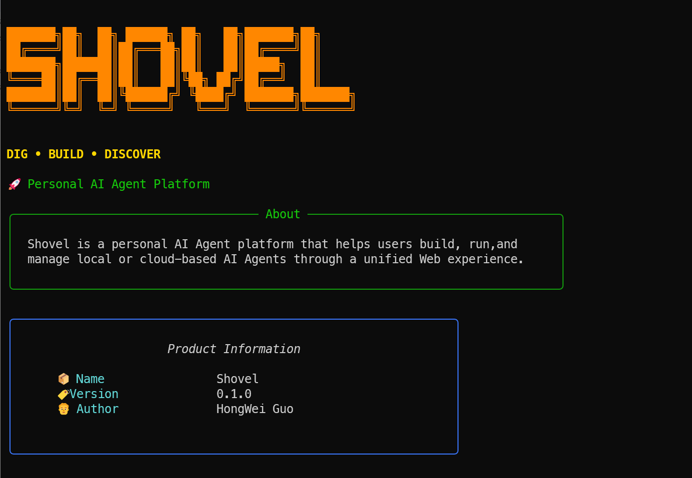
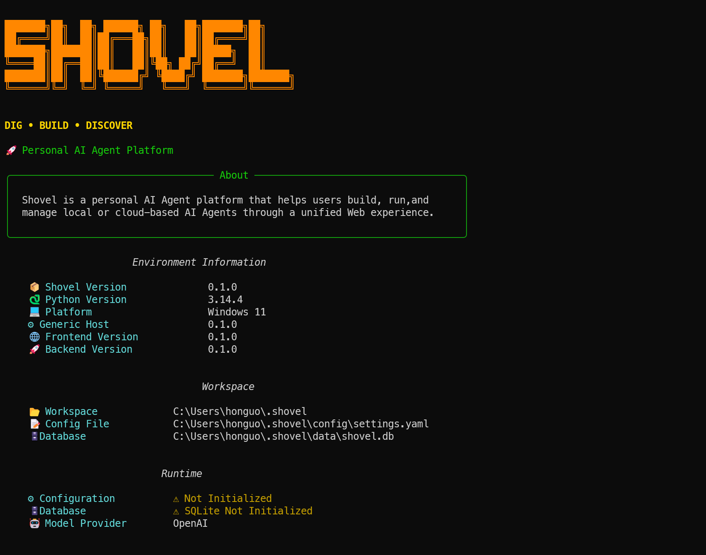

# `Hello, Shovel!`

`Shovel` is a personal AI Agent platform that helps users build, run, and manage local or cloud-based AI Agents through a unified Web experience.

Let's us Say :

```bash
uv run shovel version
```



Again, let us Say:

```bash
uv run shovel version --verbose
```


